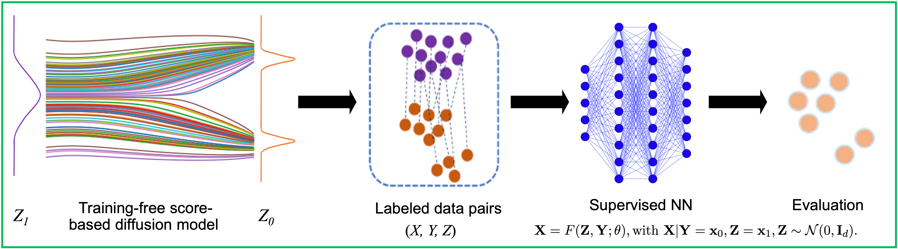

# Why GenAI4UQ?

A general-purpose conditional generative model, capable of calibrating models, quantifying uncertainty, and making forecasts efficiently.

## Key Capabilities:

<ol>
  <li>Replaces traditional inverse modeling methods (MCMC + surrogate models)</li>
  <li>Predicts model input parameters directly from observations after training</li>
  <li>Generates model output predictions efficiently based on new observations</li>
  <li>Delivers ensemble forecasts with comprehensive uncertainty quantification</li>
  <li>High computational efficiency and storage efficiency</li>
</ol>

## Efficient: 

Hyperparameter tuning built-in

Just provide your data!

## Comprehensive: 

Ready-to-use examples for diverse scientific problems.

# Installing GenAI4UQ

torch version: 1.11.0

sklearn version: 1.2.2

Specifically, installing Ray Tune: Hyperparameter Tuning:  https://docs.ray.io/en/latest/ray-overview/installation.html

installing HyperOptSearch from Ray Tune: pip install -U hyperopt   https://docs.ray.io/en/latest/tune/api/doc/ray.tune.search.hyperopt.HyperOptSearch.html

# Below are three illustrative examples demonstrating its capabilities:

## Example 1: Bimodal Function Calibration
We calibrate input parameter x given y:  `y = x² + θ`, where `θ` represents random perturbations, and quantify the associated uncertainty of input parameter x.

### Instructions
1. In the config.py, modify the following: 
   
   USE_SYNTHETIC_DATA = True
   
2. Run the main script:
   python main.py
3. The results, including parameter posterior samples and predictive uncertainty, will be saved in the Results directory.
4. For additional evalutaion analysis, run python Evaluation.py such as modifying the nubmer of generated ensembles (Npath = 2000)

## Example 2: Calibrating the ELM Model at the Missouri Ozark AmeriFlux Site
We calibrate the Ecosystem Land Model (ELM) using observational data from the Missouri Ozark AmeriFlux site. The objective is to quantify the uncertainty for eight sensitive parameters, given five observation variables.

### Instructions
1. In the config.py, modify the following: 
   
   USE_SYNTHETIC_DATA = False
   
   X_SAMPLE_PATH = 'Dataset/ELM/InputPara.npy'   # Model parameters (X)
   
   Y_SAMPLE_PATH = 'Dataset/ELM/Observations.npy'     # Observations (Y)
   
2. python main.py
3. The results, including parameter posterior samples and predictive uncertainty, will be saved in the Results directory.
4. For additional evalutaion analysis, run python Evaluation.py such as modifying the nubmer of generated ensembles (Npath = 2000)

## Example 3: High-Dimensional Target Variable Prediction – Geological Carbon Storage Case
We forecast the full 2D pressure distribution (64x128 grid) for a geological storage application. Observations are from 10 monitoring points at the injection well. 

Refer to folder:  Example3_GeologicalCarbonStorage

### Instructions
1. Download the dataset:
   Dataset: dP_train_u.pt [Download here](https://drive.google.com/drive/folders/1fZQfMn_vsjKUXAfRV0q_gswtl8JEkVGo)
   Refer to the original article: https://www-sciencedirect-com.ornl.idm.oclc.org/science/article/pii/S0309170822000562#d1e8497
2. Run dimension reduction: python AE_V2.py
   This reduces the forecast variables from the original 64x128 grid to a latent dimension of 20.
3. In the config.py, modify the following: 
   
   USE_SYNTHETIC_DATA = False
   
   X_SAMPLE_PATH = 'Dataset/Co2_Pressure/pre_latent.npy'   # Model parameters (X)
   
   Y_SAMPLE_PATH = 'Dataset/Co2_Pressure/pre_observation.npy'     # Observations (Y)
   
5. Run the main script for forecasting: python main.py
6. Evaluate testing cases: python Evaluation_co2.py
7. Transform the latent dimensions back to the original space:  python Pres_pred.py
8. The prediction and reconstuction results will be saved in the Results directory.

# Reference:
1. Fan, M., Liu, Y., Lu, D., Wang, H. and Zhang, G., 2024. A novel conditional generative model for efficient ensemble forecasts of state variables in large-scale geological carbon storage. Journal of Hydrology, p.132323. (https://doi.org/10.1016/j.jhydrol.2024.132323)
2. Lu, D., Liu, Y., Zhang, Z., Bao, F. and Zhang, G., 2024. A diffusion‐based uncertainty quantification method to advance E3SM land model calibration. Journal of Geophysical Research: Machine Learning and Computation, 1(3), p.e2024JH000234. (https://doi.org/10.1029/2024JH000234)
3. Liu, Y., Yang, M., Zhang, Z., Bao, F., Cao, Y. and Zhang, G., 2024. Diffusion-model-assisted supervised learning of generative models for density estimation, Journal of Machine Learning for Modeling and Computing, 5(1), pp. 25-38 (https://www.dl.begellhouse.com/journals/558048804a15188a,34cd19111b07668e,297525503398a70f.html)
4. Bao, F., Zhang, Z. and Zhang, G, 2024. An ensemble score filter for tracking high-dimensional nonlinear dynamical system, Computer Methods in Applied Mechanics and Engineering, 432, Part B, 117447 (https://doi.org/10.1016/j.cma.2024.117447)
5. Bao, F., Zhang, Z. and Zhang, G., 2024. A score-based filter for nonlinear data assimilation. Journal of Computational Physics, 514, 113207 (https://doi.org/10.1016/j.jcp.2024.113207)
